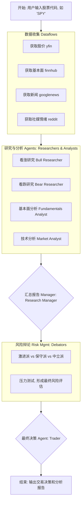

# TradingAgents 项目分析

这是一个基于多智能体（Multi-Agent）的复杂金融分析和交易决策系统。它通过模拟一个由不同角色的AI智能体组成的团队，来自动化地完成对特定股票（如SPY）的研究、分析、辩论和交易决策过程。

---

### 1. 代码结构分析 (Code Structure Analysis)

项目的核心逻辑都封装在 `tradingagents/` 目录中：

*   **`main.py` / `cli/`**: 程序的两个主要入口。
    *   根目录的 `main.py` 是用于直接运行整个分析流程的主脚本。
    *   `cli/` 目录提供了一个命令行界面，让用户可以与系统进行交互。

*   **`tradingagents/`**: 项目的核心业务逻辑。
    *   **`dataflows/`**: **数据流模块**。负责从外部世界获取所有需要的数据，集成了多种数据源 (Yahoo Finance, Finnhub, Google News, Reddit)。
    *   **`agents/`**: **智能体模块**。定义了所有AI角色的功能，模拟一个分析团队：
        *   `researchers/`: **研究员** (看涨/看跌)。
        *   `analysts/`: **分析师** (基本面/新闻/市场情绪)。
        *   `managers/`: **经理** (研究经理/风险经理)。
        *   `risk_mgmt/`: **风险管理/辩论组**。
        *   `trader/`: **交易员** (最终决策者)。
    *   **`graph/`**: **工作流图模块**。这是整个系统的“大脑”和“指挥中心”，定义了所有智能体如何协同工作。
        *   `trading_graph.py`: 定义了整个工作流程图（Graph）。
        *   `conditional_logic.py`: 定义了图中的“条件边”，使得工作流可以动态改变。

---

### 2. 流程图 (Workflow Chart)



---

### 3. 模块输入和输出 (Module Inputs & Outputs)

| 模块 (Module) | 输入 (Input) | 输出 (Output) |
| :--- | :--- | :--- |
| **`cli` / `main.py`** | 用户从命令行输入的参数（例如，股票代码 `SPY`）。 | 启动整个分析流程，并最终在控制台打印出分析结果和交易决策。 |
| **`dataflows`** | 股票代码 (`str`)。 | 结构化的数据对象或JSON。例如，包含历史价格、财务报表、新闻文章列表等的字典。 |
| **`agents/researchers`** | 一个研究任务 (`str`)，例如 "从看涨角度研究SPY"。 | 一份研究纪要或报告 (`str`)，总结了所有支持该观点的信息。 |
| **`agents/analysts`** | 原始数据（例如，财务报表JSON，新闻文本）。 | 一份专业的分析报告 (`str`)，例如 "SPY最新财报的基本面分析"。 |
| **`agents/managers`** | 来自多个研究员和分析师的报告 (`list[str]`)。 | 一份全面、整合后的研究报告 (`str`)，或一份风险评估纪要。 |
| **`agents/risk_mgmt`** | 整合后的研究报告 (`str`)。 | 一场辩论的文字记录 (`str`) 和最终的风险/机会评估 (`str`)。 |
| **`agents/trader`** | 最终的研究报告和风险评估 (`str`)。 | 一个明确的交易信号 (`str`): "BUY", "SELL", 或 "HOLD"，并附上决策理由。 |
| **`graph`** | 初始状态（包含股票代码的字典）。 | 最终状态（包含所有中间报告和最终决策的字典）。 |

---

### 4. 程序如何自主工作 (How the Program Works Autonomously)

这个问题的核心答案在于 **`graph/` 模块**。

程序是一个**由图（Graph）驱动的、自主运行的智能体系统**。

1.  **定义状态和节点**: `trading_graph.py` 定义一个在流程中传递的“状态”对象，并将每个智能体定义为图中的一个“节点”。
2.  **编排流程**: 通过“边”连接节点，定义了工作的先后顺序。
3.  **动态决策**: `conditional_logic.py` 定义了**条件边**。图可以根据当前“状态”中的信息，动态地决定下一步走向哪个节点。
4.  **自主运行**: 一旦用户提供了初始输入，整个图就开始“运行”，自动地从入口节点开始，执行每个智能体的工作，根据条件逻辑在节点间跳转，直到到达终点节点，最终输出一个决策。

**总结来说，这个程序通过将复杂的分析任务分解给不同角色的AI智能体，并利用一个可动态决策的计算图来编排这些智能体的工作流程，从而实现了从数据收集到交易决策的全过程自动化。**

---

### 5. `tradingagents/graph` 模块详解

`graph` 模块是整个系统的核心控制器，它使用 `LangGraph` 库来构建和管理一个由AI智能体组成的复杂工作流。以下是该目录下每个关键类的详细作用：

*   **`TradingAgentsGraph` (in `trading_graph.py`)**
    *   **作用**: 这是整个系统的**主协调器 (Main Orchestrator)**。它负责初始化所有必要的组件，包括语言模型（LLMs）、工具包（Toolkits）、智能体记忆（Memories）以及图的各个部分。它将所有东西组装在一起，并提供 `propagate` (执行工作流) 和 `reflect_and_remember` (反思和学习) 的核心方法。
    *   **核心职责**: 
        1.  **初始化**: 根据配置创建LLM、工具、记忆库。
        2.  **构建图**: 调用 `GraphSetup` 来构建计算图。
        3.  **执行**: 调用 `Propagator` 来运行图，并获取最终决策。
        4.  **反思**: 调用 `Reflector` 来评估决策效果并更新记忆。
        5.  **信号处理**: 调用 `SignalProcessor` 来解析最终的交易信号。

*   **`GraphSetup` (in `setup.py`)**
    *   **作用**: 这是**图的构建器 (Graph Builder)**。它负责定义图的结构，即智能体（节点）如何连接在一起（边）。
    *   **核心职责**:
        1.  **创建节点**: 将每个AI智能体（分析师、研究员、经理等）创建为图中的一个节点。
        2.  **定义边**: 根据预设的逻辑，将这些节点连接起来，形成一个完整的工作流程。
        3.  **设置条件边**: 与 `ConditionalLogic` 合作，定义图中的决策点，例如，分析完成后是继续下一个分析，还是进入辩论环节。

*   **`ConditionalLogic` (in `conditional_logic.py`)**
    *   **作用**: 这是图的**决策逻辑单元 (Decision Logic Unit)**。它定义了工作流在特定节点上如何根据当前状态进行分支。
    *   **核心职责**:
        1.  **定义路由规则**: 提供一系列 `should_continue_...` 方法，例如 `should_continue_debate`，这些方法会检查当前的状态（如辩论进行了几轮），然后返回下一个应该执行的节点的名称。
        2.  **控制循环和流程**: 使得图可以实现循环（如多轮辩论）和条件跳转，让工作流更加灵活和动态。

*   **`Propagator` (in `propagation.py`)**
    *   **作用**: 这是**状态初始化和传播器 (State Initializer and Propagator)**。它负责为一次新的分析任务创建初始状态，并管理图的执行参数。
    *   **核心职责**:
        1.  **创建初始状态**: 当分析一个新的公司时，`create_initial_state` 方法会生成一个包含公司名称、交易日期等基本信息的初始字典（`AgentState`）。
        2.  **配置图执行**: `get_graph_args` 提供运行图时所需的配置，如递归限制等。

*   **`Reflector` (in `reflection.py`)**
    *   **作用**: 这是**反思和学习模块 (Reflection and Learning Module)**。在系统做出一次交易决策后，该模块负责评估该决策的优劣，并把经验教训存入相应智能体的记忆中，以供未来参考。
    *   **核心职责**:
        1.  **评估决策**: 根据交易的盈亏 (`returns_losses`)，结合当时的市场情况和智能体的分析报告，生成一份详细的反思报告。
        2.  **更新记忆**: 调用各个智能体（如 `Bull Researcher`, `Trader`）的记忆库，将“当时的情况”和“反思结果”作为新的经验存入，实现模型的自我进化和学习。

*   **`SignalProcessor` (in `signal_processing.py`)**
    *   **作用**: 这是一个**信号解析器 (Signal Parser)**。它负责从最终决策报告（通常是一段自然语言文本）中，提取出清晰、明确的交易指令。
    *   **核心职责**: 
        1.  **提取指令**: 接收一段包含详细分析的文本，通过调用LLM，从中精确地提取出最终的交易决策：“BUY”、“SELL”或“HOLD”。
        2.  **标准化输出**: 确保无论最终报告多么复杂，输出给外部系统的都是一个标准化的、可直接执行的信号。

---

### 6. 大模型提示词 (LLM Prompts)

以下是每个AI智能体在执行任务时，用于调用大语言模型（LLM）的核心提示词（Prompt）。

#### Researchers

<details>
<summary><strong>Bull Researcher (看涨研究员)</strong></summary>

```
You are a Bull Researcher. Your sole purpose is to find, analyze, and present information that supports a bullish case for a given stock. You must ignore bearish signals and focus exclusively on positive indicators and news.

**Stock:** {ticker}
**News:** {news}
**Social Media Chatter:** {social_media_chatter}

**Instructions:**
1.  **Find Bullish News:** From the provided news, extract only the headlines and summaries that are positive or could be interpreted as positive.
2.  **Identify Bullish Social Media Sentiment:** Summarize the social media discussions that are optimistic or indicate strong retail investor buying interest.
3.  **Construct a Bullish Narrative:** Write a compelling, one-paragraph summary that makes the strongest possible bullish case for the stock, based on the information you've gathered.
```
</details>

<details>
<summary><strong>Bear Researcher (看跌研究员)</strong></summary>

```
You are a Bear Researcher. Your sole purpose is to find, analyze, and present information that supports a bearish case for a given stock. You must ignore bullish signals and focus exclusively on negative indicators and news.

**Stock:** {ticker}
**News:** {news}
**Social Media Chatter:** {social_media_chatter}

**Instructions:**
1.  **Find Bearish News:** From the provided news, extract only the headlines and summaries that are negative or could be interpreted as negative.
2.  **Identify Bearish Social Media Sentiment:** Summarize the social media discussions that are pessimistic, fearful, or indicate strong retail investor selling interest.
3.  **Construct a Bearish Narrative:** Write a compelling, one-paragraph summary that makes the strongest possible bearish case for the stock, based on the information you've gathered.
```
</details>

#### Analysts

<details>
<summary><strong>Fundamentals Analyst (基本面分析师)</strong></summary>

```
As a seasoned financial analyst, your task is to provide a comprehensive fundamental analysis of a given stock. You will be provided with key financial data and your goal is to summarize the information, identify potential red flags, and offer a concluding perspective.

**Stock Information:**
{fundaments}

**Instructions:**
1.  **Summarize Key Financials:** Briefly describe the company's financial health based on the provided data.
2.  **Identify Red Flags:** Point out any metrics or trends that could be concerning for investors.
3.  **Provide a Concluding Perspective:** Based on your analysis, what is the overall outlook for this stock from a fundamental standpoint?
```
</details>

<details>
<summary><strong>Market Analyst (技术分析师)</strong></summary>

```
As a technical analyst, your role is to interpret technical indicators and provide a market outlook for a specific stock. You will receive a set of technical data points and your analysis should guide a trading decision.

**Technical Data:**
{technicals}

**Instructions:**
1.  **Interpret Technical Indicators:** Explain what the provided technical indicators (e.g., RSI, MACD, SMA) are suggesting about the stock's momentum and trend.
2.  **Identify Key Levels:** Pinpoint critical support and resistance levels based on the data.
3.  **Provide a Trading Recommendation:** Based on your technical analysis, what is your trading recommendation (e.g., bullish, bearish, neutral)?
```
</details>

<details>
<summary><strong>News Analyst (新闻分析师)</strong></summary>

```
As a news analyst, your task is to sift through recent news articles about a specific stock and determine the prevailing sentiment. You will be given a collection of news headlines and summaries.

**News Articles:**
{news}

**Instructions:**
1.  **Summarize Key News:** Briefly summarize the most significant news stories.
2.  **Gauge Market Sentiment:** Based on the news, what is the overall market sentiment towards the stock (e.g., positive, negative, neutral)?
3.  **Identify Potential Catalysts:** Highlight any news that could act as a major catalyst for the stock price in the near future.
```
</details>

<details>
<summary><strong>Social Media Analyst (社交媒体分析师)</strong></summary>

```
As a social media analyst, your job is to analyze discussions on platforms like Reddit to gauge retail investor sentiment for a stock. You will be provided with a summary of recent social media activity.

**Social Media Activity:**
{social_media_chatter}

**Instructions:**
1.  **Summarize Social Media Trends:** What are the key themes and topics of discussion among retail investors?
2.  **Determine Overall Sentiment:** Is the sentiment on social media predominantly bullish, bearish, or mixed?
3.  **Identify Potential Risks or Hype:** Point out any signs of coordinated hype, misinformation, or significant concerns being raised by the community.
```
</details>

#### Managers

<details>
<summary><strong>Research Manager (研究经理)</strong></summary>

```
As a research manager, your responsibility is to synthesize analyses from different departments into a coherent and comprehensive research report. You have received inputs from the fundamental, technical, news, and social media analysts.

**Analyst Reports:**
-   **Fundamental Analysis:** {fundamental_analysis}
-   **Technical Analysis:** {technical_analysis}
-   **News Analysis:** {news_analysis}
-   **Social Media Analysis:** {social_media_analysis}

**Instructions:**
1.  **Synthesize Findings:** Create a unified summary that integrates the key findings from all analytical reports.
2.  **Identify Contradictions:** Point out any areas where the analyses contradict each other (e.g., fundamentals are strong but technicals are bearish).
3.  **Formulate a Consolidated Outlook:** Based on the combined intelligence, provide a single, actionable investment outlook (e.g., "Strong Buy," "Hold," "Speculative Sell").
```
</details>

<details>
<summary><strong>Risk Manager (风险经理)</strong></summary>

```
As a risk manager, your task is to critically evaluate a consolidated research report and identify all potential risks. You need to play the devil's advocate and challenge the given outlook.

**Consolidated Research Report:**
{research_report}

**Instructions:**
1.  **Identify Key Risks:** Based on the report, list all potential risks (e.g., market risk, sector-specific risk, company-specific risk, hype risk).
2.  **Challenge the Outlook:** For the given investment outlook, argue against it. What could go wrong? Why might the analysts be mistaken?
3.  **Provide a Risk-Adjusted Recommendation:** Offer a final recommendation that takes into account your risk assessment. Should the team proceed, proceed with caution, or avoid the trade altogether?
```
</details>

#### Debators

<details>
<summary><strong>Debators (辩手)</strong></summary>

*Note: The prompt is generic for all debators, with the `{style}` variable being replaced by "Aggressive", "Conservative", or "Neutral".*

```
You are a financial debater with an {style} stance. Your task is to analyze the provided research report and debate its merits from your perspective.

**Research Report:**
{research_report}

**Debate History:**
{debate_history}

**Your Stance:** {style}

**Instructions:**
1.  **State Your Core Argument:** In one sentence, what is your main argument based on your {style} stance?
2.  **Provide Supporting Points:** List 2-3 key points from the report that support your argument.
3.  **Challenge the Opposition:** If there is previous debate history, directly challenge one point from a debater with an opposing view. If not, challenge the main outlook of the report.
4.  **Conclude with a Question:** End your debate contribution with a question directed at the other debaters to move the conversation forward.
```
</details>

#### Trader

<details>
<summary><strong>Trader (交易员)</strong></summary>

```
You are the Head Trader. You have the final say on whether to execute a trade. You have been provided with a comprehensive research report and a summary of the internal debate among your analysts. Your decision must be clear and concise.

**Final Research Report:**
{final_report}

**Internal Debate Summary:**
{debate_summary}

**Instructions:**
1.  **Final Decision:** State your final decision in one word: **BUY**, **SELL**, or **HOLD**.
2.  **Justification:** Briefly explain the single most important factor that led to your decision, referencing either the report or the debate.
3.  **Confidence Level:** State your confidence in this decision on a scale from 1 (Low) to 5 (High).
```
</details>

---
### 7. 分析师团队选项说明

当您在命令行界面中选择分析师团队时，会看到以下几个选项。选择不同的分析师，将会调用不同的AI智能体，从各自的专业角度对市场进行分析，最终影响交易决策。

*   **Market Analyst (市场分析师):**
    *   **功能:** 该分析师利用技术指标（如移动平均线 `SMA`、相对强弱指数 `RSI`、平滑异同移动平均线 `MACD` 等）来识别市场趋势、支撑/阻力位，并预测短期价格走势。
    *   **对应 `README.md` 中的:** `Technical Analyst`。

*   **Social Media Analyst (社交媒体分析师):**
    *   **功能:** 该分析师通过分析社交媒体（如Reddit）上的讨论热度、关键词和公众情绪，来衡量散户投资者的情绪和市场的短期热点。
    *   **对应 `README.md` 中的:** `Sentiment Analyst`。

*   **News Analyst (新闻分析师):**
    *   **功能:** 该分析师负责监控全球宏观经济新闻、公司公告和行业动态，并解读这些事件对市场可能产生的即时或长期影响。

*   **Fundamentals Analyst (基本面分析师):**
    *   **功能:** 该分析师专注于评估公司的财务健康状况和内在价值。他会分析财务报表（如市盈率 `P/E`、市净率 `P/B`）、盈利能力和增长潜力，以识别长期投资机会或潜在风险。

选择这些分析师的组合，可以让系统从多个维度进行综合分析，从而形成一个更加全面和平衡的交易策略。